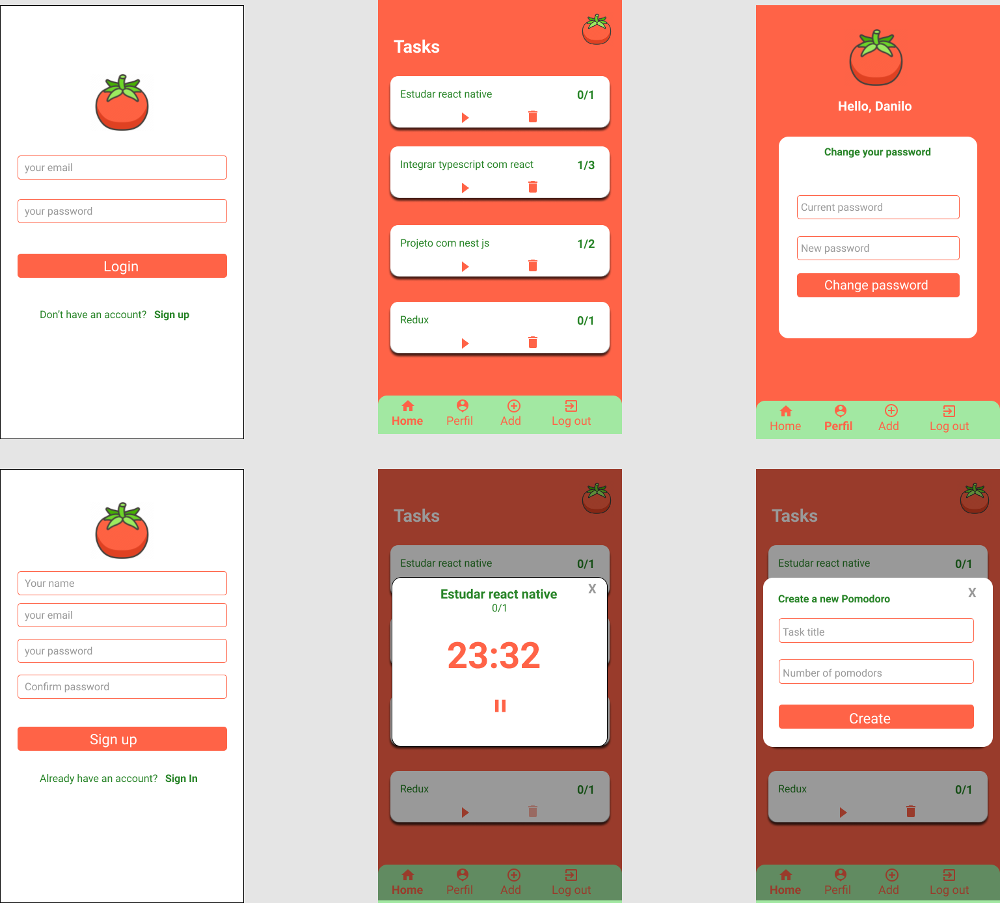

# App pomodoro

App to help you study using the pomodoro technique

## Getting Started

How can you run the app on you machine (or smartphone)

### Dependencies

1. nodejs
2. npm/yarn
3. react native cli
4. android sdk
5. android emulator (or your physical device)

### Installing

```
  git clone git@github.com:DaniloMarques1/pomodoro.git
```

Go to the mobile directory, switch to the **mobile** branch (git checkout mobile) then run yarn install (or just yarn).

Now with the emulator running or your physical device connected to the computer, run:

```
  yarn android
```

## Layout

Layout do app feito no figma


## TODO:
